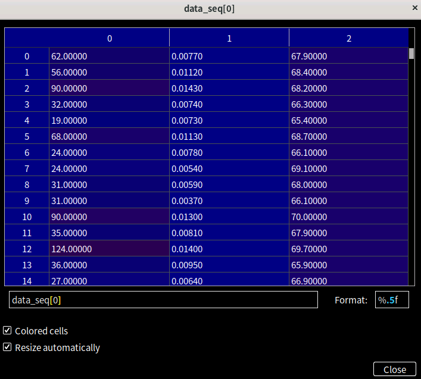
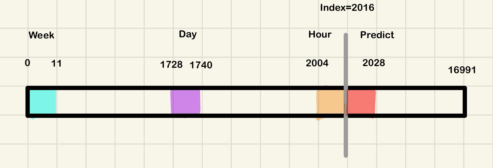

**This file amis to describe data processing code, including data formate, code strcuture and final train/val/test data.**  
There are two data prcocessing codes coming from  **[ASTGCN](https://github.com/guoshnBJTU/ASTGCN-r-pytorch) & [DCRNN](https://github.com/liyaguang/DCRNN)**. 

* ASTGCN  

In PEMS04, raw data's size is (16992,307,3). You can change the number of week/day/hour in XX.conf file. The number of week means how many weeks are choosen, similar with the number of day/hour. The details of dataset are shown in the below pic.

<!--    -->

  

As you can see, the first dimension of raw data is that the collected traffic speed/flow/occupancy.(a data is generated by a sensor in a five-minute interval). 307 represents the number of sensor. For example, if you set the number of week = 1 (other number can also be chosen, in this example, the other parameters is also set to 1), the whole process can be presented by the below pic.  

<!--    -->

One week's data is 12×24×7 = 2016, one day's data is 24×12 = 288，one hour's data is 1×12 = 12. More specifically, see the below table:
| week   | day | hour |
| ----   | ----| ---- |
| last week(7 days ago) 8:00-9:00| current week 8:00-9:00 July, 18th | current week 8:00-9:00 July, 19th |  

Above this, the code chooses the same time sequence, but in different days.

The execution process of the code:  
1. Function: **read_and_generate_dataset()** is used to deal with the several functions and generate the final dataset.  
2. Function: **get_sample_indices()** is used to generate the index of data.  
3. Function: **search_data()** is used to gets the data sample from data_seq by the index of data.  

In the first step, data_seq is made up of sequence_length, num_of_vertices, num_of_features. Cos i set the number of week to 1, data_seq[2016] is the starter. Then, code executes to the second step, the start_idx & end_idx (can be seen in func **get_sample_indices()**) are equal to 0 & 12 respectively, which represents the index of week. Finally, go to the thrid step. Using the second index result, week_sample gets the data from the data_seq[0:11,:,:].The other two parts(day and hour) are the same process. day_sample = data_seq[1728:1740,:,:], hour_sample = data_seq[2004:2016,:,:], target = data_seq[2016:2028,:,:]

After the 2 & 3 steps, the code returns to the first step. Now, sample includes week'data, day's data, hours's data and predicted data. Then, transpose the sample's shape from (sequence_length, num_of vertices, number_of_features) to (num_of_vertices, num_of_features, sequence_length). 

Note: in the return step, target original owns three features, but in this process, target only get the target[:,:,0], which owns one feature(speed?). There is a new parameter called time_sample storing the idx(the loop's index/ data's index). 

* DCRNN

In Metr-LA, dataframe's size is (34272, 207), the detail is shown in the below pic. There are two functions called **generate_train_val_test()** and **generate_graph_seq2seq_io_data()** respectively.

In **generate_train_val_test()**, x_offsets and y_offsets are built for locating the data's index.  
|x_offsets|y_offsets|
|---|---|
|[-11:0]|[1:12]|  

And step into **generate_graph_seq2seq_io_data()**, dataframe adds a dimension in axis=2, whose(data) size becomes (34272, 207, 1). **time_ind** comes from data's time index divided by a day's second, for example, time index is 5 minutes (300 seconds), and a day's second is 24×60×60 (86400), so 300/68400 = 0.003472, **time_ind** (34272,1) is made up of by this way. **time_in_day** (34272, 207, 1) is made up of by copying **time_ind** 207 times and transposing it into (2,1,0). This process can be represented by the following pic.

Concatenate data and time_in day. After that, use x_offset and y_offset to generate the x and y. Finally, return to **generate_train_val_test()** for split the data into train/val/test.
